

  
  <h2>A Learning and Retention Tool</h2>

Learning Goals
- My first Full Stack Development Project (PERN)
- Project management over a set amount of time (a semester)

*Final Project* 
**MemorEase** was inspired by the pay wall implemented into the popular app Quizlet. In MemorEase, users can input their notes to create a study set. Within these study sets, users can use 3 different learning modes and a mini game to learn and retain. Users also have the ability to collaborate. You can share your study sets with others and/or save others' sets to your dashboard.
https://www.memorease.shop/

  <h2>~ The Home Page ~</h2>
  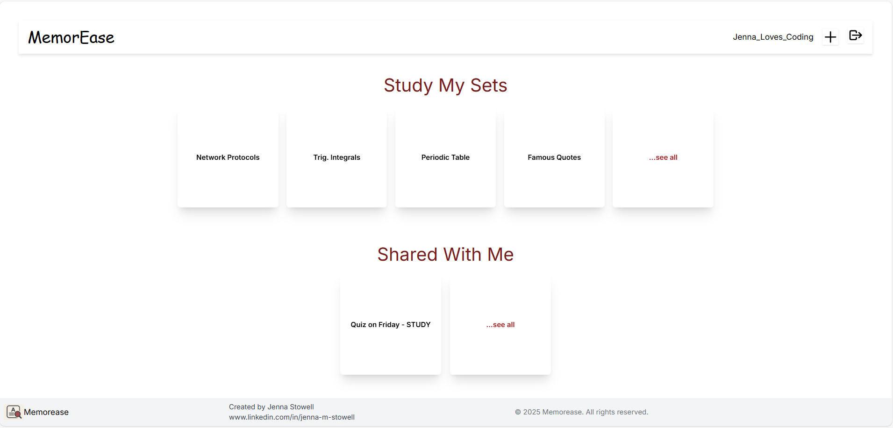
  <h4>Flips upon hover</h4>
  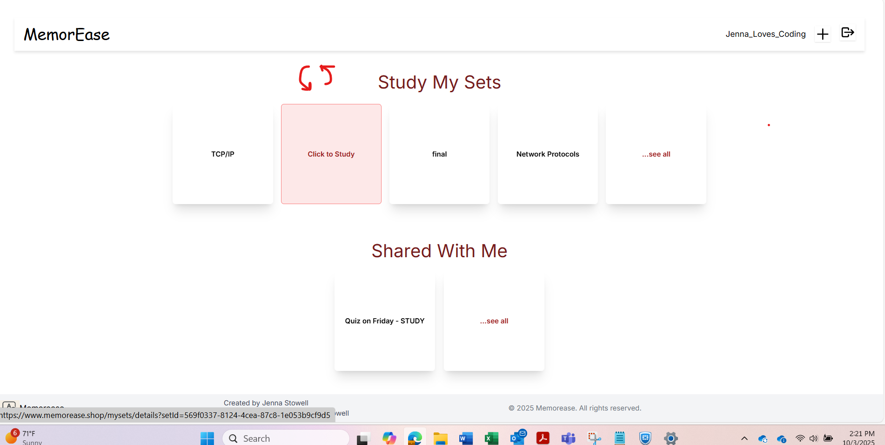

  <h2>~ Inside The Study Set ~</h2>
  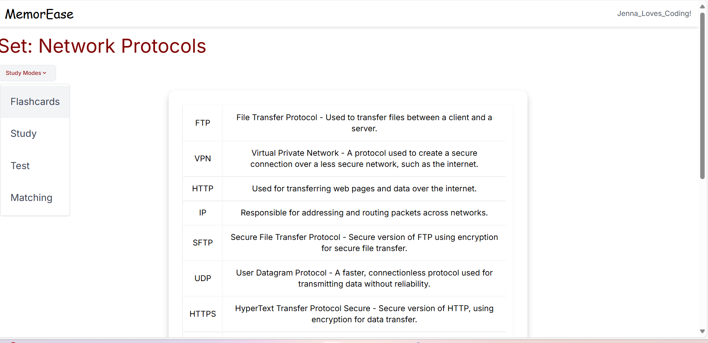

  <h2>~ Flashcards ~</h2>
  <h4>Flips upon hover</h4>
  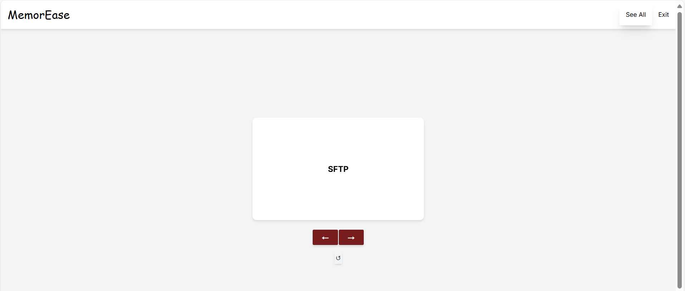
  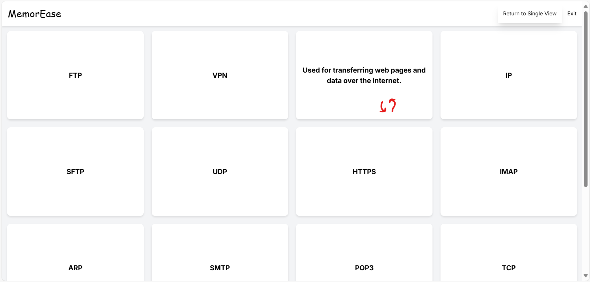

  <h2>~ Practice Mode ~</h2>
  <h4>Chunks the information out for you and enforces repetion</h4>
  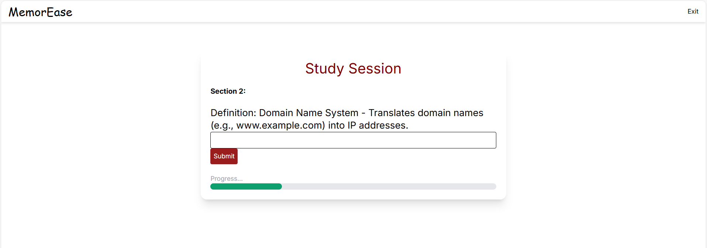

  <h2>~ Test Mode ~</h2>
  <h3>Written Answer or Multiple Choice</h3>
  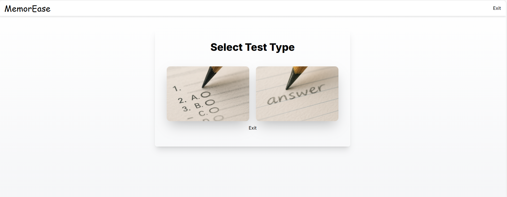
  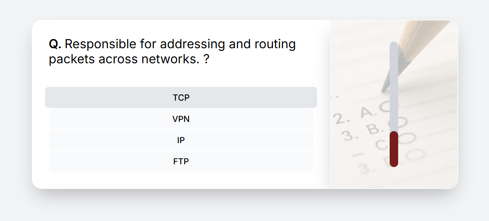
  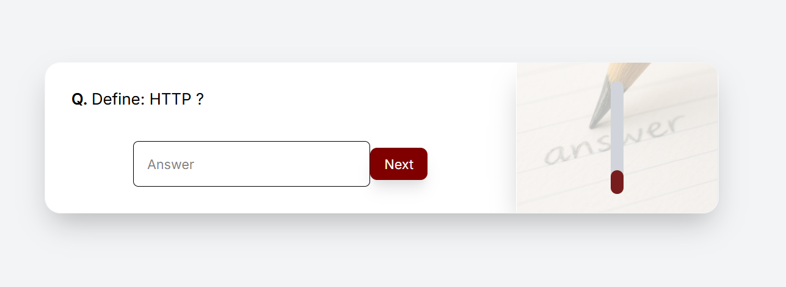
  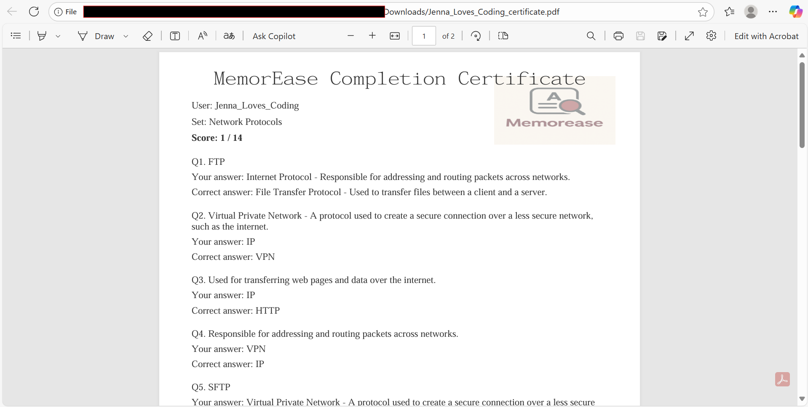

  <h2>~ Matching Game ~</h2>
  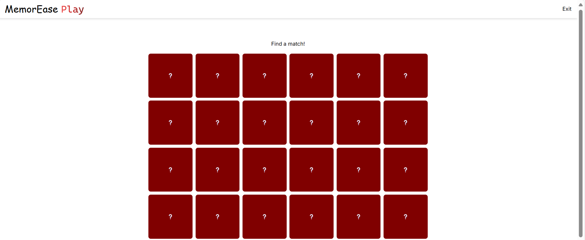

  <h2>~ Misc. UI/UX ~</h2>
  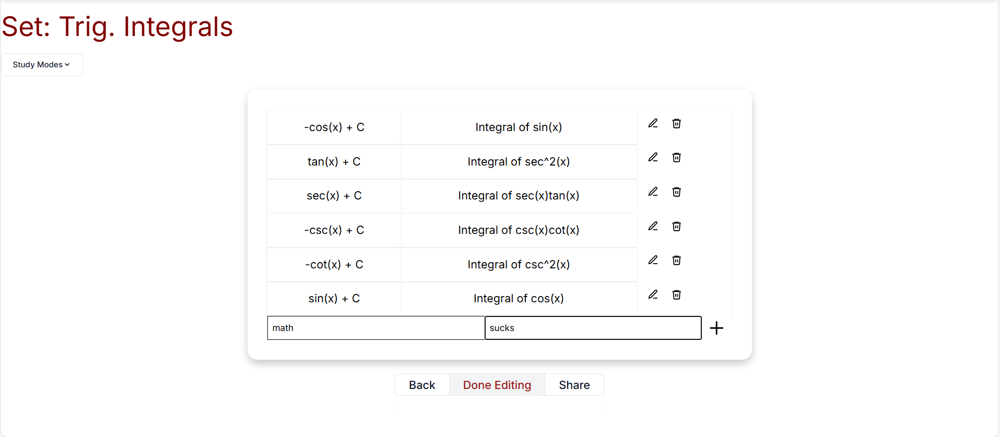
  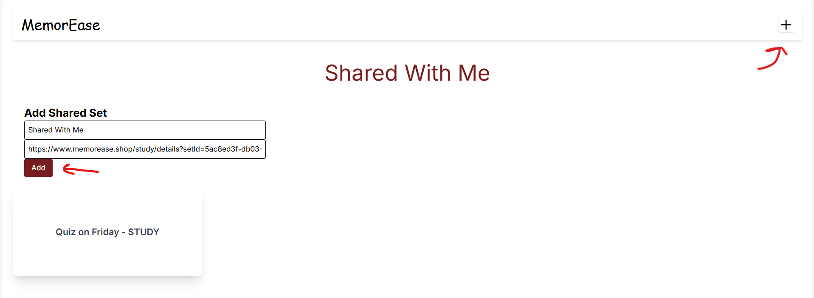
  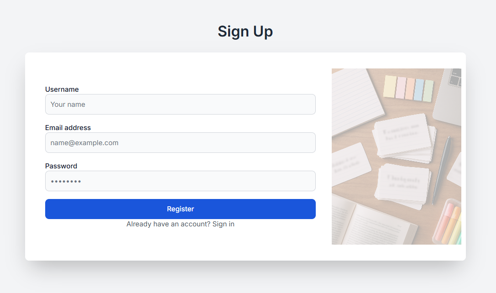

